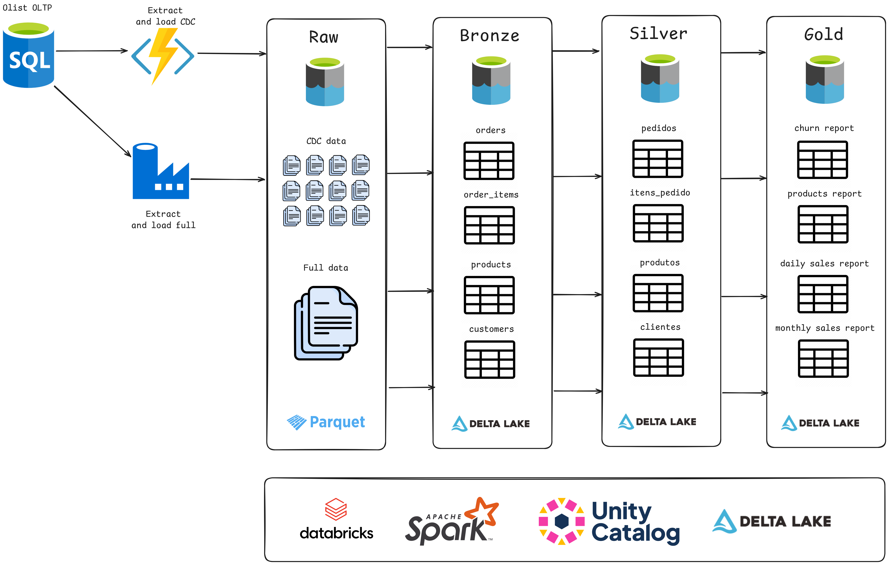

# Data Lakehouse - Olist

## 1. Motivação do projeto

Este projeto tem como objetivo praticar os conceitos da arquitetura de Data Lakehouse utilizando dados públicos e simulando um cenário de ingestão de dados com CDC (Change Data Capture).

Neste projeto consegui aprender tudo que envolve a arquitetura Lakehouse no Databricks. Usando `Unity Catalog`, Streaming em batch com `Cloudfiles`, integração com `GitHub` e `GitHub Actions` e orquestração de jobs com o Databricks `Workflows`.

## 2. Os dados 

Os dados utilizados foram da plataforma Kaggle, a partir dele gerei dados para datas futuras simulando um cenário de CDC. Os dados aleatórios gerados vinham com as seguintes colunas:
* **Op**: Operação feita na linha, podendo ser "U" (Update) e "I" (Insert). Optei por não utilizar a deleção neste projeto.
* **modified_at**: Quando foi feita a operação na linha 

Utilizei as seguintes tabelas fornecidas pelo Kaggle:
* orders
* order_items
* order_payments
* products
* customers
* sellers

Link do dataset: https://www.kaggle.com/datasets/olistbr/brazilian-ecommerce/data

## 3. Arquitetura Medallion

Utilizei a arquitetura Medallion da seguinte maneira

* **Camada Raw** : Nesta camada, os dados chegam através de carga full e CDC. A carga full é feita uma vez e as modificações a partir disso vem através do CDC, onde cada linha representa o estado da linha. Os dados chegam no formato **parquet**
* **Camada Bronze**: Esta camada deve refletir exatamente a base original de dados, fazendo o upsert a partir do CDC, mantendo apenas a última versão das linhas que são inseridas, atualizadas e deletadas. Nenhuma mudança é feita nos dados nesta camada. Os dados desta camada e das seguintes utiliza o formato **delta**.
* **Camada Silver**: Esta camada deve refletir a camada bronze, mas com mudanças na taxonomia e filtros a nível de coluna. Pode ser feito o mascaramento de dados nesta etapa. Nenhuma mudança é feita nos dados nesta camada. 
* **Camada Gold**: Esta é a camada de negócios. Neste projeto optei por usar o cubo de dados, usando as datas como dimensão para agregações. Esta camada será fonte para análise e ciência de dados e gerar valor para o negócio.

## 4. Métodos de ingestão

### 4.1 Ingestão full

Carrega a tabela de origem inteira e sobrescreve no destino. Deleta, caso exista,checkpoints de CDC/CDF.

### 4.2 Ingestão incremental CDC

Utiliza o conceito de Stream em batch do Databricks para localizar no arquivo de checkpoint qual foi o último arquivo CDC da origem a ser carregado, e faz a carga dos próximos. 

Utiliza o método upsert para inserir, atualizar e deletar os últimos egistros baseado na coluna "Op" e "modified_at", mantando os dados consistentes com a origem.

Usado na ingestão da camada Raw para bronze.

### 4.3 Ingestão incremental CDF

Busca no feed do Databricks onde foi feita a última carga e procura dados novos a partir desta. 

Utiliza o método upsert para inserir, atualizar e deletar os últimos egistros baseado na coluna "Op" e "modified_at", mantando os dados consistentes com a origem.

Usado na ingestão da camada bronze para silver.

### 4.4 Ingestão incremental na camada Gold

Neste método, dados consolidados das camadas anteriores são carregados para a camada Gold, que geralmente corresponde à camada de apresentação. 

A ingestão incremental na Gold é feita para atualizar relatórios, dashboards e modelos analíticos com dados recentes, mantendo a performance otimizada.

Utilizamos o método backfill para atualizar as tabelas gold com novos dados em um intervalo definido de datas, normalmente a data do dia anterior. 

## 5 Como implementar novas tabelas em cada camada

### 5.1 Bronze

* Criar um arquivo contendo o schema da tabela {table_name}.json
* Criar uma nova task similar aos outros jobs de bronze 
    * Nome da task
    * Parâmetros

### 5.2 Silver

* Criar um arquivo contendo a consulta SQL da tabela {table_name}.sql
* Criar uma nova task similar aos outros jobs de silver 
    * Nome da task
    * Parâmetros
    * Task da bronze que depende

### 5.3 Gold

* Criar um arquivo contendo a consulta SQL da tabela {table_name}.sql
* Criar uma nova task similar aos outros jobs de silver 
    * Nome da task
    * Parâmetros
    * Tasks da silver que depende

## 6. Jobs 

Os jobs são configurados no diretório `src/workflows/olist.json` e o **GitHub Actions** atualiza as tasks automaticamente no Databricks ao fazer push na branch main do projeto.

## 7. Referências

* Playlist lago do mago do TéoMeWhy: https://www.youtube.com/watch?v=tFkcPfkM8Io&list=PLvlkVRRKOYFTcLehYZ2Bd5hGIcLH0dJHE
* Repositório do lago do mago do TéoMeWhy:  https://github.com/TeoMeWhy/lago-mago/tree/main